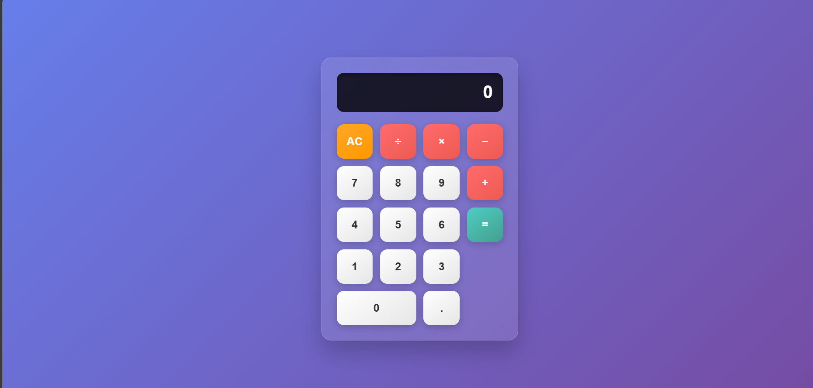

# CodSoft Web Development Internship Tasks


This repository contains all the tasks I completed during my Web Development Internship at **CodSoft**. The internship provided a great opportunity to enhance my front-end development skills by working on practical projects.

## 📋 Table of Contents

1.  [Task 1: Personal Portfolio Website](#-task-1-personal-portfolio-website)
2.  [Task 2: Landing Page](#-task-2-landing-page)
3.  [Task 3: Calculator](#-task-3-calculator)
4.  [Technologies Used](#️-technologies-used)
5.  [How to Run](#-how-to-run)
6.  [Acknowledgments](#-acknowledgments)

---

### 📁 Task 1: Personal Portfolio Website

A clean and responsive personal portfolio website built to showcase my skills, projects, and contact information. The design is modern and focuses on providing a great user experience with smooth scrolling and interactive elements.

**🎥 Video Demo:**
[Watch the screen recording](./assets/personalPortfolio.mp4)

---

### 📁 Task 2: Landing Page

A visually appealing landing page for "The Green Bean," a fictional coffee shop. This project demonstrates the ability to translate a design concept into a functional and responsive webpage using HTML and CSS.


---

### 📁 Task 3: Calculator

A fully functional web-based calculator with basic arithmetic operations. This project showcases JavaScript skills in handling user input, performing calculations, and manipulating the DOM. The UI is built with CSS Grid for a clean and modern layout.



---

### 🛠️ Technologies Used

* **HTML5:** For structuring the web content.
* **CSS3:** For styling, layout (including Flexbox and Grid), and animations.
* **JavaScript:** For interactivity and functional logic.
* **Git & GitHub:** For version control and project management.

---

### 🚀 How to Run

Each project is self-contained in its own folder. To view a project locally:
1.  Clone the repository:
    ```bash
    git clone [https://github.com/Abhisheks42/CODSOFT.git](https://github.com/Abhisheks42/CODSOFT.git)
    ```
2.  Navigate to the project folder you want to view:
    ```bash
    cd [project-folder-name] 
    # e.g., cd "Task 3 - Calculator"
    ```
3.  Open the `index.html` file in your favorite web browser.

---

### 🙏 Acknowledgments

I would like to thank **CodSoft** for providing this invaluable internship opportunity. I am grateful for the chance to work on these projects, which have significantly helped in honing my web development skills.

---

**Connect with me:**

[](www.linkedin.com/in/abhishek-sharma-7905002b3)
[](https://github.com/Abhisheks42)
